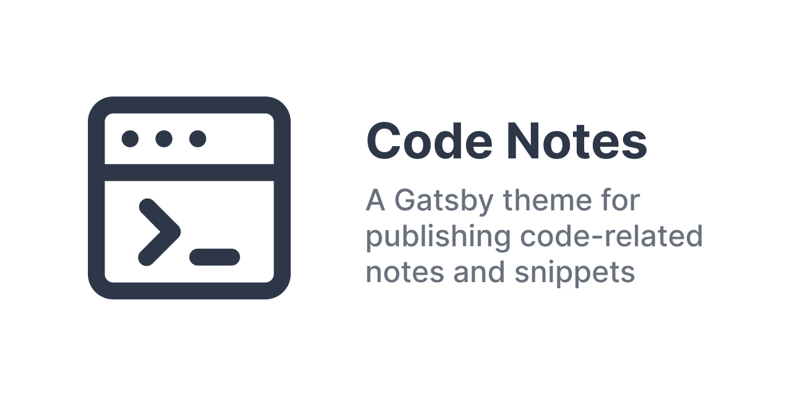

> This theme adds a few additional features to standard markdown.

## Images




Embed images using the usual markdown syntax.

```md

```

## Fenced code blocks

Like you use with GitHub, e.g.

    ```js
    const variable = 42
    ```

### Highlighting lines in code blocks

To highlight lines, wrap line with this comment before: `// highlight-start` and this after `// highlight-end`. **Ensure that these comments are not indented.**

```css
.grid {
  // highlight-start
  display: grid;
  grid-gap: 30px;
  // highlight-end
  grid-template-columns: repeat(auto-fill, 112px);
  /* or this */
  grid-template-columns: repeat(auto-fill, minmax(112px, 1fr));
}
```

      ```css
      .grid {
      // highlight-start
        display: grid;
        grid-gap: 30px;
      // highlight-end
        grid-template-columns: repeat(auto-fill, 112px);
        /* or this */
        grid-template-columns: repeat(auto-fill, minmax(112px, 1fr));
      }
      ```

## Emoji short codes

Like this: :joy: :eggplant:

```md
Like this: :joy: :eggplant:
```

## Details/Summary

<details>
  <summary>Open example</summary>

Tada! :tada:

```html
<details>
  <summary>Open example</summary>

  Tada! :tada:
</details>
```

</details>

## Tables

Tables are responsive by default. If you need to limit line length for a cell, add a `<br/>` tag to break the lines.

| Tables              | Are                                                                                 | Cool                                                      |
| ------------------- | ----------------------------------------------------------------------------------- | --------------------------------------------------------- |
| This is a row       | with some                                                                           | content                                                   |
| This is another row | with a lot more content. <br/>Nullam netus eu fringilla turpis parturient dignissim | Velit ut mauris penatibus <br/>turpis commodo consectetur |

## Link truncation

This uses [remark-truncate-links](https://github.com/GaiAma/Coding4GaiAma/tree/master/packages/remark-truncate-links) to truncate links. e.g. https://github.com/mrmartineau/gatsby-theme-code-notes
